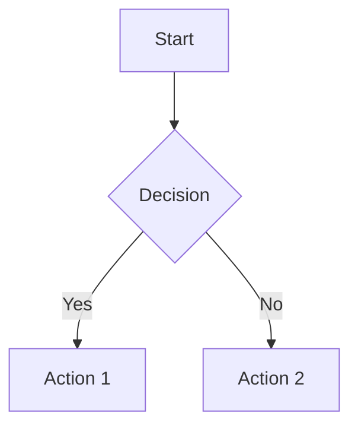

# Slidev Presentation Skill

This skill enables creation of beautiful, developer-friendly presentations using Slidev - a Markdown-based slide maker powered by Vue 3 and Vite.

## Core Capabilities

### 1. Markdown-Based Slides

Write presentations in Markdown with powerful features:

- Simple slide separation with `---`
- YAML frontmatter for configuration
- Rich text formatting
- Code blocks with syntax highlighting
- LaTeX mathematical equations
- Mermaid diagrams

### 2. Code Features

Perfect for technical presentations:

- Syntax highlighting for 100+ languages
- Line highlighting and focusing
- Monaco editor integration for live editing
- Code block animations
- Diff highlighting

### 3. Visual Features

- Built-in themes (default, seriph, apple-basic, etc.)
- Custom CSS styling
- Slide layouts (cover, intro, two-cols, image, etc.)
- Animations and transitions
- Drawing and annotations

### 4. Export Options

- PDF export for sharing
- PPTX export for PowerPoint
- PNG images per slide
- SPA (Single Page Application) for web hosting

## Getting Started

### Installation

```bash
# Create new project
npm init slidev@latest

# Or use npx directly
npx slidev slides.md
```

### Basic Slide Structure

```markdown
---
theme: default
title: My Presentation
---

# Welcome to My Talk

This is the first slide

---

# Second Slide

Content goes here

---
layout: two-cols
---

# Two Column Layout

::left::
Left content

::right::
Right content
```

## Slide Syntax

### Frontmatter Configuration

```yaml
---
theme: seriph
background: https://example.com/bg.jpg
class: text-center
highlighter: shiki
lineNumbers: true
drawings:
  persist: false
transition: slide-left
title: Presentation Title
---
```

### Available Layouts

| Layout | Description |
|--------|-------------|
| `default` | Standard content layout |
| `center` | Centered content |
| `cover` | Title/cover slide |
| `intro` | Introduction slide |
| `two-cols` | Two column layout |
| `image` | Full image slide |
| `image-left` | Image on left |
| `image-right` | Image on right |
| `quote` | Quote layout |
| `section` | Section divider |
| `fact` | Key fact highlight |
| `statement` | Bold statement |
| `end` | Ending slide |

### Code Blocks

````markdown
```python {2,3|5-7}
# Line highlighting example
def hello():
    print("Hello")  # highlighted first

    for i in range(3):  # highlighted second
        print(i)
```
````

### LaTeX Math

```markdown
Inline: $E = mc^2$

Display:
$$
\int_{-\infty}^{\infty} e^{-x^2} dx = \sqrt{\pi}
$$
```

### Mermaid Diagrams

````markdown

````

### Speaker Notes

```markdown
---

# Slide Title

Content visible to audience

<!--
These are speaker notes.
Only visible in presenter mode.
Press 'p' to enter presenter mode.
-->
```

## CLI Commands

### Development

```bash
# Start dev server
npx slidev slides.md

# Start on specific port
npx slidev slides.md --port 3030

# Open in browser automatically
npx slidev slides.md --open
```

### Export

```bash
# Export to PDF
npx slidev export slides.md

# Export to PPTX
npx slidev export slides.md --format pptx

# Export to PNG images
npx slidev export slides.md --format png

# Export with dark mode
npx slidev export slides.md --dark

# Custom output path
npx slidev export slides.md --output presentation.pdf
```

### Build

```bash
# Build static SPA
npx slidev build slides.md

# Build to specific directory
npx slidev build slides.md --out dist
```

## Keyboard Shortcuts

| Key | Action |
|-----|--------|
| `Space` / `Right` | Next slide |
| `Left` | Previous slide |
| `Up` | Previous animation |
| `Down` | Next animation |
| `f` | Toggle fullscreen |
| `o` | Toggle overview |
| `d` | Toggle dark mode |
| `p` | Presenter mode |
| `g` | Go to slide |
| `Esc` | Exit mode |

## Themes

### Built-in Themes

- `default` - Clean, minimal
- `seriph` - Professional serif fonts
- `apple-basic` - Apple-inspired
- `bricks` - Colorful blocks
- `shibainu` - Cute, playful

### Using Themes

```yaml
---
theme: seriph
---
```

### Custom Styling

```markdown
---

# Styled Slide

<style>
h1 {
  background-color: #2B90B6;
  background-image: linear-gradient(45deg, #4EC5D4 10%, #146b8c 20%);
  background-size: 100%;
  -webkit-background-clip: text;
  -webkit-text-fill-color: transparent;
}
</style>
```

## Advanced Features

### Vue Components

```markdown
<Counter :count="10" />

<Tweet id="1390115482657726468" />
```

### Clicks and Animations

```markdown
<v-clicks>

- Item 1
- Item 2
- Item 3

</v-clicks>
```

### Global Components

Create `components/` directory for custom Vue components:

```
slides/
├── slides.md
├── components/
│   └── MyComponent.vue
└── styles/
    └── custom.css
```

## Workflow Patterns

### Academic Presentation

1. Create title slide with `layout: cover`
2. Add agenda with bullet points
3. Use LaTeX for equations
4. Include Mermaid for methodology diagrams
5. Add code examples if applicable
6. Export to PDF for submission

### Technical Demo

1. Start with problem statement
2. Show architecture with Mermaid
3. Walk through code with highlighting
4. Use Monaco editor for live coding
5. Build SPA for interactive sharing

### Conference Talk

1. Design eye-catching cover
2. Keep slides minimal (10-20-30 rule)
3. Use animations sparingly
4. Add speaker notes for each slide
5. Practice with presenter mode
6. Export PDF as backup

## Best Practices

1. **Keep it Simple**: One idea per slide
2. **Use Code Highlighting**: Guide attention
3. **Test Exports**: Check PDF/PPTX before presenting
4. **Prepare Offline**: Build SPA as backup
5. **Practice**: Use presenter mode to rehearse
6. **Version Control**: Track slides.md in git

## Environment Requirements

- Node.js >= 18.0
- npm or pnpm package manager
- Modern browser for development

## Integration with Other Skills

- **latex-writing**: Share equation syntax
- **data-visualization**: Export charts as images
- **academic-research**: Include citations
- **presentation-creator**: Use agent for content planning
